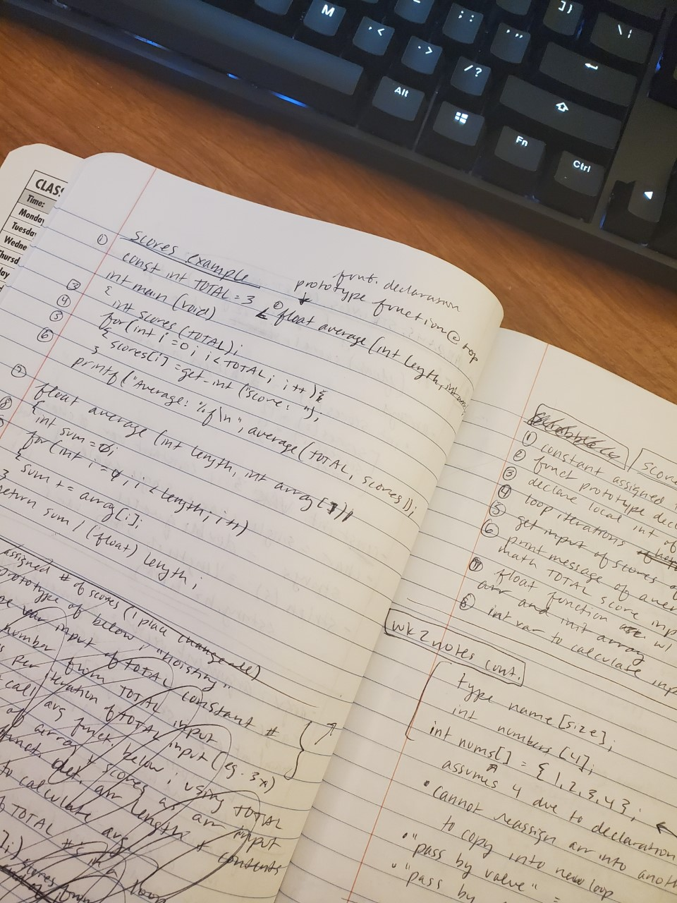

Hey, first post! 

First week into restarting CS50 for the... third time? Last two times I was woefully unprepared, had limited patience with my self, and rage quitted barely through the first week. Things have changed a little since then.

Fast forward a couple of years, revising my career and coding goals, this course aligns closer to my learning and career goals with a total of 10 weeks of intro to computer science (CS) and an 8 week expansion into web after that. Those goals? I wanted to get some more exposure into CS fundamentals, expand my JavaScript knowledge, practice Python, and introduce more database and framework projects. Ideally, I'd like to work into a fullstack web development or software engineering role.

As a slightly impatient visual learner, I have slightly goofed with this first week thinking I could just read through the course notes and comprehend what I'll need to know for the code lab and future problem sets. Not quite. The lectures may be a bit longer, but they give great examples, explain processes and so much more that I needed from just reading sparse notes. 

Another way I adjusted how I learn is by keeping a specific topic notebook for code, write out code problems, and number each line to explain each step in a way I would understand better. If something was still confusing, I could pinpoint and search for a better way to explain the point and write that down too. This has helped with problem sets already to refer back to! A (blurry) example like so...

 

I've already gotten past the bump of week 1 and needed that extra push since that is where I gave up the last couple times. I'm already chugging along to week two and seeing it will be getting steadily harder each week (duh). With my previous knowledge of JavaScript, it's easier to explain or understand some concepts since the fundamentals are pretty similar, but some are quite different. First that came to mind was arrays; with [C you have to say how long the array is](https://www.programiz.com/c-programming/c-arrays), but with JavaScript, they're a bit more lax on creation. One part of a problem set, I knew how to write out the loop in JavaScript and then converted to C, ha! I've gotten a little more comfortable with C and haven't done that since. 

 

The great thing about CS50 I've noticed already is the enormous community surrounding it, I've already joined the Reddit group, Discord and googling for hints (not exact solutions) on the web makes it easier to find a few ways to make sure the concepts click. Such as, there was one YouTube video walking through the Scrabble problem set I found after working through most all the problem except for one last piece that some written help couldnt and noted that in my code notebook. I haven't jumped into the Discord too often, but it's definitely active for each lab and problem set channel for questions and help. 

Anywho, on to week two!

-- H